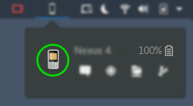
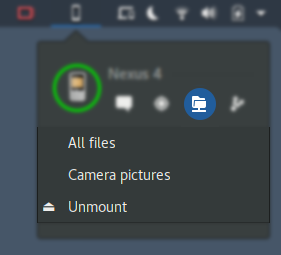
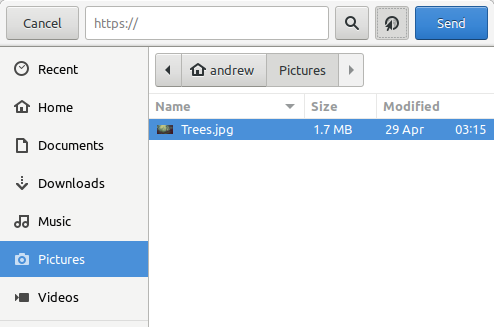

> ***THIS PAGE IS INCOMPLETE AND/OR OUTDATED***

### Device Preferences

Each device has a menu with items for pairing, connecting and device actions if connected. The Sharing page contains the most commonly configured options, determining what information and actions the remote device can access.

![Devices Page][preferences-device-menu]

### Plugins

All supported plugins are enabled by default and can be disabled in the **Advanced** page. Below is a brief overview of each plugin's purpose.

![Devices Page][preferences-device-advanced]

#### Battery

Allows you to monitor the battery level and charging state of a remote device, as well as report local power statistics. A low battery notification will be shown if the device requests it, which may have a button allowing you to ring the device.

#### Contacts

Work In Progress

#### Clipboard

Allows you to sync the desktop and remote device clipboard content (**text** only). You can choose the direction of automatic sync and assign keyboard shortcuts to "push" and "pull" the current clipboard content.

#### Find My Phone

Allows you to make a remote device ring to help quickly locate it. It also allows remote devices to do the same.

![Locate Device plugin as seen in the Device Menu][device-menu-locate]

#### Mousepad

Allows a remote device to control the desktop mouse and keyboard. This plugin is disabled on Wayland ([Accessibility + Wayland](https://wiki.gnome.org/Accessibility/Wayland)).

#### MPRIS

The Media Player Control plugin allows remote devices to control local MPRIS2 capable media players on your desktop.

#### Notification

Allows you to sync notifications between two devices, with options for what notifications to forward.

#### Ping

Allows you to send and receive pings to/from remote devices, with an optional message. Currently there is no user interface for sending pings.

#### Run Commands

Allows you define local commands that can be executed by remote devices and execute remote commands defined by remote devices. The commands are run with `/bin/sh -c`.

#### SFTP

Allows you to mount device filesystems and browse the files. Usually the filesystem will delay connecting until the directory is accessed. It can be mounted using the menu action otherwise.

There are a number of known issues with SFTP/SSHFS on Android; See the [bugs posted on the KDE Connect bug tracker](https://bugs.kde.org/buglist.cgi?quicksearch=kdeconnect%20sftp) before opening an issue.

#### Share

The Share Plugin allows you send and receive files or links. Received files will be saved in Downloads.

If you have Nautilus Integration enabled, you can also send files (but not directories) from the file browser context menu.

#### SMS

Work In Progress

#### Telephony

Notifies you of incoming and in progress phone calls. Notifications for incoming calls will allow you to mute the ringer. You can choose to automatically adjust the system volume and pause playing media when the phone is ringing or answered.

### Keyboard Shortcuts
The extension allows you to assign keyboard shortcuts to device actions.

* Extension shortcuts will be rejected if already registered for another device function or by the Gnome Control Center
* A keyboard shortcut set in Gnome Control Center will override an extension shortcut **without warning**
* Extension shortcuts are bound to the *global* Gnome Shell area and will override *local* window shortcuts **without warning**

[preferences-device-advanced]: ../extra/gsconnect/preferences-device-advanced.png
[preferences-device-menu]: ../extra/gsconnect/preferences-device-menu.png
[preferences-device-sharing]: ../extra/gsconnect/preferences-device-sharing.png
